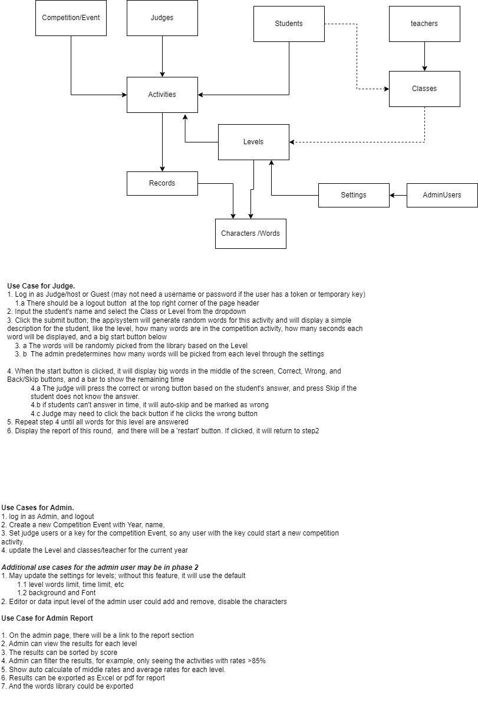
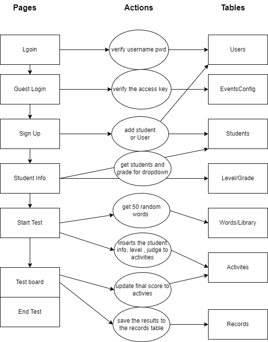

# ChineseCharactersRecognitionApp
This is  a volunteer project for MLCCC.org (Main Line Chinese Culture Center), Demo/POC of a Chinese Characters Recognition App for students learning Chinese.

[project plan](./doc/ProjectPlan.md)

## Graphic Design

[MLCCC Word Test prototype graphic design](https://xd.adobe.com/view/a2d9ae3f-716f-4af7-accb-02deac8f8764-f78a/) by Annabelle.

[CCRApp Html Demo](https://stoneskin.github.io/Demo/CCRApp/login.html)

UI design html , css and image files could be find in `UI_Design` folder

## Page architecture

## Project Technical stack

### programming language used by project

    - Html, CSS , Javascript 
    - PHP
    - MySql/Mariadb

### Development Tools

- [VSCode](https://code.visualstudio.com)    as primary IDE
    - with html and PHP extensions      
- [XAMPP](https://www.apachefriends.org/) for local database and PHP running env 
    -   MariaDB is open source version of MySql
- [Git](https://git-scm.com/)  and [GitHub](https://github.com/) as source code repository tool. 
    - [learn github](https://stoneskin.github.io/Tools/Git.01-LearnToUseGitForVersionControl.html) 
    - using [github within vscode](https://stoneskin.github.io/python/4_Github/4.1_GithubAndVSCode.html)

## Contribute to the projects

- Only [MLCCC](https://mlccc.org/)  members could contribute to this project
- For How to start development and contribution, please check [Developer Guide](./doc/developer_guideline.md)