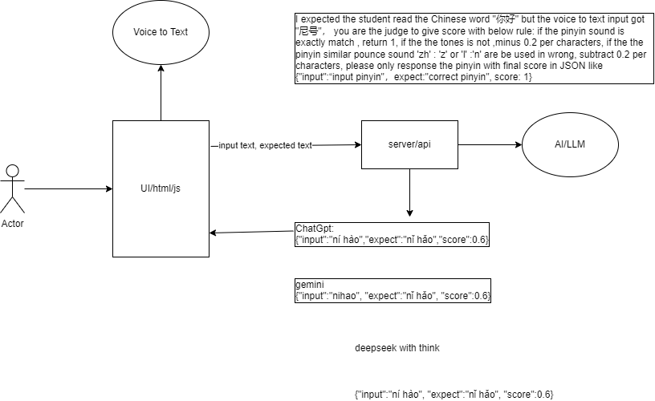

# Design for build a AI Judge (pinyin pronunciation scoring) System for CCR

## 1. Introduction

The AI Judge System for CCR is a system that evaluates the pronunciation of a user's pinyin input and provides a score based on the accuracy of the pronunciation. First the UI will use the voice recognition to get Chinese words, then send to input words and the correct words to the backend api, the backend api will call a AI LLM to get the pinying and score. and  return the score to the UI.

## 2. Diagram


## 3. The score rules

### Scoring Logic for Pinyin Pronunciation Evaluation

1. **Exact Match**:
   - If the input pinyin matches the expected pinyin exactly in both sound and tone, the score is **1**.

2. **Tone Mismatch**:
   - For each character where the tone does not match the expected tone, subtract **0.2** from the score.

3. **Sound Substitution**:
   - For each character where a similar sound is used incorrectly (based on a predefined list of similar sounds), subtract **0.2** from the score.

4. **Combination of Errors**:
   - If a character has both a tone mismatch and a sound substitution error, subtract **0.4** from the score for that character.

5. **Wrong pronunciation**:
   - If the misused sounds not in the similar sound list, subtract **0.5** from the score for that character.

6. **Maximum Deduction**:
   - The score should not go below **0**.

### Predefined List of Similar Sounds

To ensure consistency, the following similar sounds will trigger the sound substitution penalty:

- `zh` and `z`
- `ch` and `c`
- `l` and `n`
- `in` and `ing`
- `en` and `eng`
- `min` and `ming`
- `tan` and `tang`
- `fan` and `fang`
- `xin` and `xing`
- `can` and `cang`

### Application of the Scoring Logic

- **Penalties are applied per character**. Each error in each character is penalized individually.
- The scoring system is designed to be transparent and easy to apply consistently across different inputs.

### Example Evaluations

1. **Example 1**:
   - **Expected**: `nǐ hǎo`
   - **Input**: `ní hào`
   - **Tone Mismatch**: `ní` vs. `nǐ` → subtract **0.2**
   - **Tone Mismatch**: `hào` vs. `hǎo` → subtract **0.2**
   - **Total Score**: \(1 - 0.4 = 0.6\)

2. **Example 2**:
   - **Expected**: `míng tiān`
   - **Input**: `mín tián`
   - **Sound Substitution**: `mín` for `míng` → subtract **0.2**
   - **Sound Substitution**: `tián` for `tiān` → subtract **0.4**
   - **Total Score**: \(1 - 0.6 = 0.4\)

## 4 AI code example

[Code example for the AI LLM using the groq API](codeexample.php)

The ApiKey could get from <https://console.groq.com/keys>


```php
<?php

$curl = curl_init();

curl_setopt_array($curl, [
  CURLOPT_URL => "https://api.groq.com/openai/v1/chat/completions",
  CURLOPT_RETURNTRANSFER => true,
  CURLOPT_ENCODING => "",
  CURLOPT_MAXREDIRS => 10,
  CURLOPT_TIMEOUT => 30,
  CURLOPT_HTTP_VERSION => CURL_HTTP_VERSION_1_1,
  CURLOPT_CUSTOMREQUEST => "POST",
  CURLOPT_POSTFIELDS => json_encode([
    'model' => 'deepseek-r1-distill-llama-70b',
    'messages' => [
        [
                'role' => 'system',
                'content' => 'To create a clear and consistent scoring system for evaluating pinyin pronunciation, we have developed the following logic:<BR>If the chinese characters is same, they will be correct and no subtract score. <br><br>### Scoring Logic for Pinyin Pronunciation Evaluation<br><br>1. **Exact Match**:<br>   - If the input pinyin matches the expected pinyin exactly in both sound and tone, the score is **1**.  ex: `'input':'bí lù', 'expect':'bí lù'`   <br><br>2. **Tone Mismatch**:<br>   - For each character where the tone does not match the expected tone, subtract **0.2** from the score.<br><br>3. **Sound Substitution**:<br>   - For each character where a similar sound is used incorrectly (based on a predefined list of similar sounds), subtract **0.2** from the score.<br><br>4. **Combination of Errors**:<br>   - If a character has both a tone mismatch and a sound substitution error, subtract **0.4** from the score for that character.<br>5. **Wrong pronunciation**: <br> - If the misused sounds not in the similar sound list, subtract **0.5** from the score for that character. <br>6. **Maximum Deduction**:<br>   - The score should not go below **0**.<br><br>### Predefined List of Similar Sounds<br><br>To ensure consistency, the following similar sounds will trigger the sound substitution penalty:<br><br>- `zh` and `z`<br>- `l` and `n`<br>- `in` and `ing`<br>- `en` and `eng`<br>- `min` and `ming`<br>- `tan` and `tang`<br>- `fan` and `fang`<br>- `xin` and `xing`<br>- `can` and `cang`<br><br>### Application of the Scoring Logic<br><br>- **Penalties are applied per character**. Each error in each character is penalized individually.<br>- The scoring system is designed to be transparent and easy to apply consistently across different inputs.<br><br>### Example Evaluations<br><br>1. **Example 1**:<br>   - **Expected**: `nǐ hǎo`<br>   - **Input**: `ní hào`<br>   - **Tone Mismatch**: `ní` vs. `nǐ` → subtract **0.2**<br>   - **Tone Mismatch**: `hào` vs. `hǎo` → subtract **0.2**<br>   - **Total Score**: (1 - 0.4 = 0.6)<br><br>2. **Example 2**:<br>   - **Expected**: `míng tiān`<br>   - **Input**: `mín tián`<br>   - **Sound Substitution**: `mín` for `míng` → subtract **0.2**<br>   - **Sound Substitution**: `tián` for `tiān` → subtract **0.4**<br>   - **Total Score**: (1 - 0.6 = 0.4). <Br> please only response the pinyin with final score  in JSON like {'input':'ní hào'，expect:'nǐ hǎo', score: 0.6}   '
        ],
        [
                'role' => 'user',
                'content' => ' expected: `田爷`, input:`田野` '
        ]
    ]
  ]),
  CURLOPT_HTTPHEADER => [
    "authorization: Bearer gsk_8TvOk9Np**********5UUSnJXY",
    "content-type: application/json"
  ],
]);

$response = curl_exec($curl);
$err = curl_error($curl);

curl_close($curl);

if ($err) {
  echo "cURL Error #:" . $err;
} else {
  echo $response;
}
```


## 5. The API Response

With input: 

`expected: '明天', input:'民天'`

the response should be like: 

```json
    {
        'input':'mín tián', 
        'expect':'míng tiān', 
        'score':0.6
    }
```
