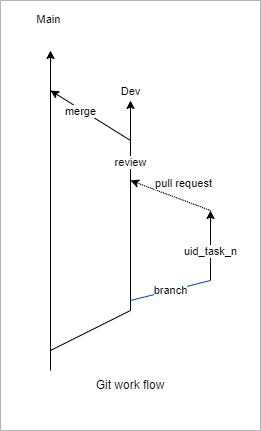
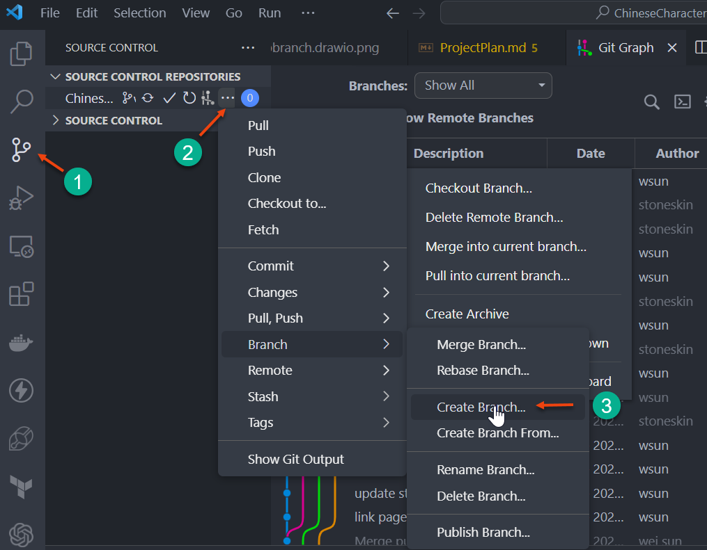

# Developer Guideline

## 1 Getting start

### 1.1 Join the team

- You must have a GitHub account
- You need to accept the invitation from the project manager as a contributor
- Please Join the team's weekly online meeting on Sunday morning as much as possible

### 1.2 Get tasks assigned

- Check the [project task page](https://github.com/users/stoneskin/projects/1). Look for the tasks you want to work on and ask the project manager to assign the task to you.
- Check or Report issues to the  [project Issues](https://github.com/stoneskin/ChineseCharactersRecognitionApp/issues) page, and wait project manager create a tasks.

### 1.3 Learn during the work

- You must learn how to use the development tools and programming languages be used in this project. Please check below resources:
  - Google or chatGPT
  - W3Schools ([php & mySql](https://www.w3schools.com/php/php_mysql_intro.asp))
  - Ask for help from the project owner

### 1.4 Development environment setup

- Install [git](https://git-scm.com/)
- Install [VSCode](https://code.visualstudio.com)
  - Install Git/GitHub extensions
  - Install PHP (all in one) extensions
  - Install Html CSS Support extensions
  - Install any other extensions you like
- Install [XAMPP](https://www.apachefriends.org)

## 2. Start development

### 2.1 Development workflow

- `Clone` the project repository: <https://github.com/stoneskin/ChineseCharactersRecognitionApp.git>
- `Create a new branch` from `dev` branch with your name and task id, ex `stone_task_1`
- The new DB scripts will be stored in the db_scripts folder for you to initial the database or update the database of your local dev environment.
- Work on your project. To prevent you from losing your work in some unexpected situation, please use git commit to check your code daily. Remember to sync to the remote GitHub server.
- Completed the code change and test it in your local environment. Make sure it works as expected.
- `Create a pull request` from your working branch to the `dev` branch. (You could use the git VsCode extension or this page in GitHub: [pull request](https://github.com/stoneskin/ChineseCharactersRecognitionApp/pulls) )
- waiting for the review and feedback from the project owner
  - 

- VSCode to Create new Branch name as `{userId}-task-{issue#}`
  - 

### 2.3 Code standard

- If your work involves database change, make sure you update the scrips in the `db_scripts` folder
- Don't submit your test code or code that is not related to the tasks
- Try your best to reuse the code; Try not to copy and paste code more than twice without any changes
- Formate your code before submitting a pull request

